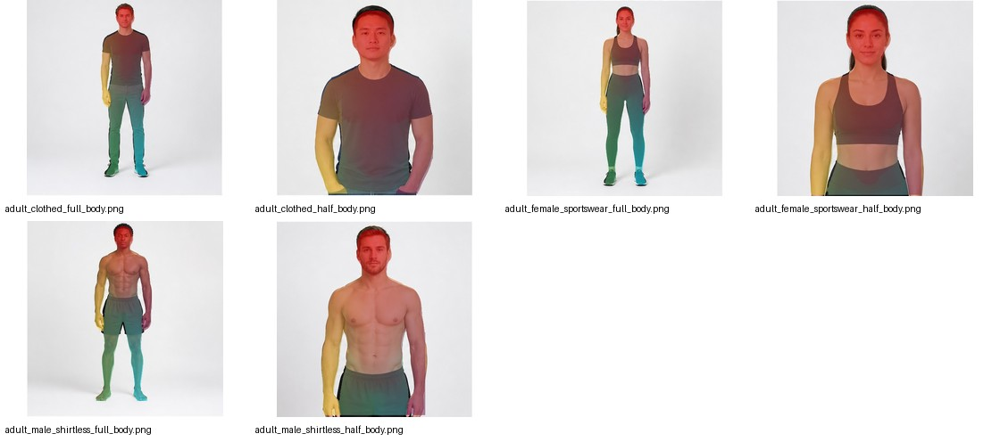

# smpl_vertex_region_selector

[中文](#中文) | [English](#english)


## 中文

`smpl_vertex_region_selector` 是一个面向 DensePose CSE `smpl_27554` 模板空间的跨平台
vertex region 选择和可视化工具。它帮助你理解 `0..27553` 这些 vertex ID 在人体表面上的位置，
并按自己的业务定义导出腹部、背部、大腿、小腿、手臂等 candidate vertex ID 列表。

它适合做：

- DensePose CSE 输出检查：载入 `vertex_map.npz`，看 2D 人体像素对应哪些 3D template vertex。
- 人工定义模板 region：在 3D/2D 视图中选择 vertex，导出 JSON/CSV/TXT。
- 预标注 pipeline 前置工具：把一次性确认好的 template region 接到 parsing、mask、occlusion 等规则里。
- 公开教学 demo：不用下载 SMPL，也可以用仓库内置 demo assets 试完整 UI 和导出流程。

它不做：

- 不训练 DensePose。
- 不自带官方 SMPL 模型、DensePose 权重或大体积 licensed mesh。
- 不把 public demo 宣称为官方 SMPL/DensePose 对齐资产。

### 安装

推荐安装桌面软件完整依赖：

```bash
git clone https://github.com/ruikunl/smpl_vertex_region_selector.git
cd smpl_vertex_region_selector

# Use Python 3.10+.
python3.11 -m venv .venv
source .venv/bin/activate
python -m pip install --upgrade pip
python -m pip install -e ".[gui]"
```

启动：

```bash
smpl-region-selector
```

如果想明确打开开源 demo 资产：

```bash
smpl-region-selector --alignment-dir assets/demo_reference/public
```

fresh clone 默认会优先尝试加载 `assets/processed/alignment/`，如果没有本地真实 alignment，
就加载 `assets/demo_reference/public/`。

### 依赖分组

项目依赖分两套入口：`pyproject.toml` extras 和 `requirements*.txt`。

| 场景 | 推荐命令 | 包含依赖 |
| --- | --- | --- |
| Core CLI | `python -m pip install -e .` | `numpy`, `Pillow` |
| Desktop GUI | `python -m pip install -e ".[gui]"` | Core + `PySide6`, `open3d`, `scipy`, `trimesh` |
| Alignment | `python -m pip install -e ".[alignment]"` | Core + `scipy` |
| Development | `python -m pip install -e ".[gui,dev]"` | GUI + `pytest` |
| Everything | `python -m pip install -e ".[all]"` | GUI + alignment + dev |

`requirements` 文件对应关系：

```text
requirements-core.txt   Core CLI dependencies
requirements-gui.txt    GUI dependencies, including open3d
requirements.txt        Default desktop GUI install, references requirements-gui.txt
requirements-dev.txt    GUI + test dependencies
```

如果你更习惯 `requirements.txt`：

```bash
python -m pip install -r requirements.txt
python -m pip install -e .
```

开发测试依赖：

```bash
python -m pip install -r requirements-dev.txt
python -m pip install -e .
```

### 桌面工作流

软件有三类联动视图：

- 3D point cloud / mesh view：用于 template vertex 选择。
- Front/back/left/right 2D template views：配套权威 `vertex_id_map.npz`。
- CSE/Image view：用于导入模型输出和源图检查。

常用交互：

- 左键拖动旋转 3D 视图。
- 鼠标中键或右键拖动移动视图。
- 鼠标滚轮缩放。
- `Select`, `Rotate`, `Move` 模式在 3D viewport 左上角。
- 2D view 支持 fit、100%、缩放、平移、矩形选择和多边形选择。
- 输入 vertex ID 支持 `12, 55, 100-130` 这种格式。
- `Load CSE Map` 接受 `.npz/.npy`，key 可以是 `vertex_id` 或 `vertex_map`。
- 加载 CSE map 后会默认高亮所有有效 unique vertex ID，但不会写入 region，直到点击 `Add Selected`。

导出格式：

```text
region_map.json
region_map.csv
vertex_ids/<region>.txt
```

### 内置示例

```text
assets/demo_reference/public/
examples/images/*.png
examples/cse/vertex_maps/*.vertex_map.npz
examples/cse/overlays/*.cse_vertex_overlay.jpg
examples/cse/masks/*.foreground.png
examples/cse/cse_contact_sheet.jpg
examples/region_map.example.json
```



基本流程：

1. 运行 `smpl-region-selector`。
2. 导入 `examples/region_map.example.json`，或手动创建 region。
3. 使用 MakeHuman CC0 public demo 3D/2D 视图选择 vertex。
4. 用 `Load CSE Map` 打开 `examples/cse/vertex_maps/` 中的一个文件。
5. 用 `Load CSE Image` 打开 `examples/images/` 中的同名图片。
6. 用 box/polygon/mask 细化高亮选择。
7. 点击 `Add Selected`。
8. 导出 region bundle。

内置图片是 AI 生成的成人示例。CSE 输出是在本地 CUDA 机器上跑出的轻量结果，只包含
`.vertex_map.npz`、overlay、mask、manifest 和 summary，不包含 raw `.cse.pt`、模型权重、
官方 SMPL 文件或私有数据集图片。

### CSE `vertex_map` 是什么

DensePose CSE 会把可见人体像素映射到固定人体表面模板。对于 `smpl_27554`：

- 合法 vertex ID 范围是 `0..27553`。
- 背景通常是 `-1`。
- 每个前景像素存储最近的 template vertex ID。

所以 body-part mask 可以看成一次查表：

```python
mask = np.isin(vertex_map, abdomen_front_vertex_ids)
```

这也是本工具重点围绕 reusable template vertex ID set 的原因。

### 本地 SMPL / DensePose alignment

严肃标注工作建议在本地构建真实 alignment 资产。这些文件会被 git 忽略。

```bash
smpl-build-alignment \
  --vertex-csv assets/demo_reference/public/vertex_template_points.csv \
  --output-dir assets/processed/alignment
```

builder 会使用 ignored 目录下的 DensePose `SMPL_subdiv.mat` 和 `SMPL_SUBDIV_TRANSFORM.mat`，
生成真实 `smpl_27554` surface proxy 和 tri-view maps。

如果要使用官方 SMPL 文件做本地验证，请从 [SMPL official website](https://smpl.is.tue.mpg.de/)
注册、接受 license 后自行下载：

```bash
smpl-install-local-assets \
  --smpl-zip /path/to/SMPL_python_v.1.1.0.zip \
  --uv-zip /path/to/smpl_uv_20200910.zip

smpl-build-alignment \
  --vertex-csv assets/demo_reference/public/vertex_template_points.csv \
  --output-dir assets/processed/alignment
```

SMPL `.pkl`、DensePose raw `.mat/.pkl/.tar.gz` 和 `assets/processed/alignment/` 输出都是 local-only，
不要提交或再分发。

### 资产边界

可提交的 public assets：

- `assets/demo_reference/public/`：MakeHuman CC0 male target mesh、`smpl_27554` point map、
  tri-view PNG 和 `vertex_id_map.npz`。
- `examples/`：AI 生成成人示例图、轻量 CSE maps、masks、overlays、manifests，以及
  `region_map.example.json`。

默认 ignored 的本地资产：

- `assets/raw/`：本地 SMPL、DensePose 或其他 raw assets。
- `assets/processed/`：真实本地 alignment 输出。
- `assets/demo_reference/generated/`：本地实验生成物。
- `assets/public_examples/`：可选公开数据集下载图片。
- `outputs/`：导出、预览和实验输出。

发布资产或截图前请阅读 [docs/legal_assets.md](docs/legal_assets.md)。

### 命令参考

```text
smpl-region-selector                  Desktop GUI
smpl-preview-overlay                  Render region overlays from CSE vertex maps
smpl-prepare-assets                   Normalize a vertex_template_points.csv
smpl-build-alignment                  Build local DensePose/SMPL alignment assets
smpl-install-local-assets             Extract local SMPL/UV zip files into ignored assets/raw/
smpl-fetch-public-examples            Download optional public images into ignored assets/public_examples/
smpl-export-surface-preannotation     Convert region maps for a downstream preannotation pipeline
```

### 开发

```bash
python3.11 -m venv .venv
source .venv/bin/activate
python -m pip install --upgrade pip
python -m pip install -e ".[gui,dev]"

python -m unittest discover -s tests -v
QT_QPA_PLATFORM=offscreen smpl-region-selector --smoke-test
```

### 文档

- [DensePose CSE vertex maps](docs/cse_vertex_map.md)
- [Desktop app workflow](docs/desktop_app.md)
- [Asset layout](docs/assets.md)
- [SMPL/DensePose alignment](docs/alignment.md)
- [Legal asset boundaries](docs/legal_assets.md)
- [Region selection workflow](docs/region_selection_workflow.md)
- [Public examples](docs/public_examples.md)
- [Test plan](docs/test_plan.md)

### License

Code is released under the MIT License. Public demo assets in `assets/demo_reference/public/` use a MakeHuman CC0
target mesh plus `smpl_27554` vertex placement prepared for repository demos, and contain no SMPL model file,
DensePose raw asset, or private dataset image. Bundled people images are AI-generated adult examples. Third-party
models and datasets keep their own licenses and should remain local unless you have explicit redistribution rights.

## English

`smpl_vertex_region_selector` is a cross-platform desktop tool for selecting and inspecting DensePose CSE
`smpl_27554` vertex regions. It helps users understand where fixed template vertex IDs live on the body surface,
define custom body-part candidate regions, and inspect how image pixels map back to those IDs through CSE
`vertex_map.npz` outputs.

### Install

Recommended desktop GUI install:

```bash
git clone https://github.com/ruikunl/smpl_vertex_region_selector.git
cd smpl_vertex_region_selector

# Use Python 3.10+.
python3.11 -m venv .venv
source .venv/bin/activate
python -m pip install --upgrade pip
python -m pip install -e ".[gui]"
```

Launch:

```bash
smpl-region-selector
```

To force the bundled public demo:

```bash
smpl-region-selector --alignment-dir assets/demo_reference/public
```

### Dependency Groups

| Use case | Command | Dependencies |
| --- | --- | --- |
| Core CLI | `python -m pip install -e .` | `numpy`, `Pillow` |
| Desktop GUI | `python -m pip install -e ".[gui]"` | Core + `PySide6`, `open3d`, `scipy`, `trimesh` |
| Alignment | `python -m pip install -e ".[alignment]"` | Core + `scipy` |
| Development | `python -m pip install -e ".[gui,dev]"` | GUI + `pytest` |
| Everything | `python -m pip install -e ".[all]"` | GUI + alignment + dev |

Requirements files:

```text
requirements-core.txt   Core CLI dependencies
requirements-gui.txt    GUI dependencies, including open3d
requirements.txt        Default desktop GUI install, references requirements-gui.txt
requirements-dev.txt    GUI + test dependencies
```

Alternative requirements install:

```bash
python -m pip install -r requirements.txt
python -m pip install -e .
```

### What It Does

- Inspect DensePose CSE outputs by loading `vertex_map.npz`.
- Select reusable template vertex regions in linked 3D and 2D views.
- Import typed vertex IDs, region maps, CSE maps, source images, masks, and point CSVs.
- Export region bundles as JSON, CSV, and one TXT file per region.

### Bundled Examples

The repository includes:

```text
assets/demo_reference/public/
examples/images/*.png
examples/cse/vertex_maps/*.vertex_map.npz
examples/cse/overlays/*.cse_vertex_overlay.jpg
examples/cse/masks/*.foreground.png
examples/region_map.example.json
```

The public demo uses a MakeHuman CC0 male target mesh. The example people images are AI-generated adult examples.
The bundled CSE outputs are lightweight maps, overlays, masks, and summaries generated on a local CUDA machine.

### Asset Policy

The repository does not redistribute official SMPL model files, DensePose checkpoints, raw DensePose geometry assets,
private datasets, or purchased images. Local SMPL/DensePose alignment outputs should stay under ignored
`assets/processed/alignment/`.

For serious annotation work, build local alignment assets:

```bash
smpl-build-alignment \
  --vertex-csv assets/demo_reference/public/vertex_template_points.csv \
  --output-dir assets/processed/alignment
```

### Development

```bash
python3.11 -m venv .venv
source .venv/bin/activate
python -m pip install --upgrade pip
python -m pip install -e ".[gui,dev]"

python -m unittest discover -s tests -v
QT_QPA_PLATFORM=offscreen smpl-region-selector --smoke-test
```
