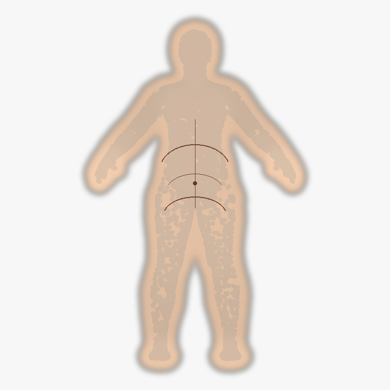

# smpl_vertex_region_selector

中文 | [English](#english)

`smpl_vertex_region_selector` 是一个面向 DensePose CSE `smpl_27554` 模板空间的跨平台
vertex region 选择和可视化工具。它的核心目标很直接：让你看懂 `0..27553` 这些 vertex ID
在人体表面上的位置，并按自己的业务定义导出腹部、背部、大腿、小腿、手臂等 candidate
vertex ID 列表。

它适合做：

- DensePose CSE 输出检查：载入 `vertex_map.npz`，看 2D 人体像素对应哪些 3D template vertex。
- 人工定义模板 region：在 3D/2D 视图中选择 vertex，导出 JSON/CSV/TXT。
- 预标注 pipeline 前置工具：把一次性确认好的 template region 接到 parsing、mask、occlusion
  等规则里。
- 公开教学 demo：不需要下载 SMPL，也可以用仓库内置 demo assets 试完整 UI 和导出流程。

它不做：

- 不训练 DensePose。
- 不自带官方 SMPL 模型、DensePose 权重或大体积 licensed mesh。
- 不把 public demo 宣称为官方 SMPL/DensePose 对齐资产。

## Preview

Public demo tri-view reference:



## Install

推荐安装桌面软件完整依赖：

```bash
git clone https://github.com/ruikunl/smpl_vertex_region_selector.git
cd smpl_vertex_region_selector

# Use Python 3.10+.
python3.11 -m venv .venv
source .venv/bin/activate
python -m pip install --upgrade pip
python -m pip install -e ".[gui]"
```

Launch the desktop app:

```bash
smpl-region-selector
```

On a fresh clone, the app loads `assets/demo_reference/public/` automatically. If you build real local
SMPL/DensePose alignment assets later, `assets/processed/alignment/` takes priority.

依赖分组：

- Core CLI: `python -m pip install -e .`
  installs `numpy` and `Pillow` for region export, overlay preview, demo data, and asset checks.
- Desktop GUI: `python -m pip install -e ".[gui]"`
  adds `PySide6`, `Open3D`, `SciPy`, and `trimesh`.
- Alignment only: `python -m pip install -e ".[alignment]"`
  adds `SciPy` for local DensePose/SMPL alignment builders.
- Development: `python -m pip install -e ".[gui,dev]"`
  adds the GUI stack plus test tooling.
- Everything: `python -m pip install -e ".[all]"`
  installs GUI, alignment, and development dependencies together.

如果你更习惯 `requirements.txt`：

```bash
python -m pip install -r requirements.txt
python -m pip install -e .
```

开发测试依赖也可以这样安装：

```bash
python -m pip install -r requirements-dev.txt
python -m pip install -e .
```

## Desktop Workflow

The app has three linked inspection surfaces:

- 3D point cloud / mesh view for template vertex selection.
- Front/back/left/right 2D template views with authoritative `vertex_id_map.npz`.
- CSE/Image view for imported model outputs and source images.

Useful interactions:

- Left drag rotates the 3D view.
- Middle/right drag moves the 3D view.
- Mouse wheel zooms.
- `Select`, `Rotate`, and `Move` modes live in the 3D viewport.
- 2D views support fit, 100%, zoom, pan, box select, and polygon select.
- Typed IDs support forms like `12, 55, 100-130`.
- `Load CSE Map` accepts `.npz/.npy` arrays with key `vertex_id` or `vertex_map`.
- Loading a CSE map highlights all valid unique vertex IDs by default; it does not add them to a region until you click `Add Selected`.

Export formats:

```text
region_map.json
region_map.csv
vertex_ids/<region>.txt
```

## Try the Bundled Example

```text
assets/demo_reference/public/
examples/region_map.example.json
```

Basic flow:

1. Run `smpl-region-selector`.
2. Import `examples/region_map.example.json`, or create a new region manually.
3. Use the MakeHuman CC0 public demo 3D/2D views to select vertices.
4. Click `Add Selected`.
5. Export your region bundle.

The CSE/Image inspector still supports user-provided `.npz/.npy` vertex maps, source images, masks, and point CSVs.
This repository no longer bundles AI-generated people images or precomputed CSE outputs.

## What Is a CSE `vertex_map`?

DensePose CSE maps visible person pixels to a fixed human surface template. For `smpl_27554`:

- valid vertex IDs are `0..27553`;
- background is usually `-1`;
- each foreground pixel stores the nearest template vertex ID.

So a body-part mask is just a lookup. If `abdomen_front` is a set of template IDs:

```python
mask = np.isin(vertex_map, abdomen_front_vertex_ids)
```

This is why the tool focuses on selecting reusable template vertex ID sets.

## Real SMPL / DensePose Alignment

For serious annotation work, build local alignment assets. These files are ignored by git.

```bash
smpl-build-alignment \
  --vertex-csv assets/demo_reference/public/vertex_template_points.csv \
  --output-dir assets/processed/alignment
```

The builder uses DensePose `SMPL_subdiv.mat` and `SMPL_SUBDIV_TRANSFORM.mat` under ignored
`assets/raw/densepose/` to produce a real `smpl_27554` surface proxy and tri-view maps.

To use official SMPL files for local validation, download them yourself from the
[SMPL official website](https://smpl.is.tue.mpg.de/) after accepting the license:

```bash
smpl-install-local-assets \
  --smpl-zip /path/to/SMPL_python_v.1.1.0.zip \
  --uv-zip /path/to/smpl_uv_20200910.zip

smpl-build-alignment \
  --vertex-csv assets/demo_reference/public/vertex_template_points.csv \
  --output-dir assets/processed/alignment
```

SMPL `.pkl`, DensePose raw `.mat/.pkl/.tar.gz`, and generated `assets/processed/alignment/` outputs
are local-only and must not be redistributed from this repository.

## Asset Policy

This repository intentionally separates public code/demo assets from local licensed assets.

Tracked public assets:

- `assets/demo_reference/public/`: MakeHuman CC0 target mesh, `smpl_27554` point map, tri-view PNGs, and
  `vertex_id_map.npz`.
- `examples/region_map.example.json`: a tiny region-map schema example.

Ignored local assets:

- `assets/raw/`: local SMPL, DensePose, or other raw assets.
- `assets/processed/`: real local alignment outputs.
- `assets/demo_reference/generated/`: optional local experiments.
- `assets/public_examples/`: optional downloaded public dataset images.
- `outputs/`: exports, previews, and experiments.

Read [docs/legal_assets.md](docs/legal_assets.md) before publishing assets or screenshots built from licensed sources.

## Command Reference

```text
smpl-region-selector                  Desktop GUI
smpl-preview-overlay                  Render region overlays from CSE vertex maps
smpl-prepare-assets                   Normalize a vertex_template_points.csv
smpl-build-alignment                  Build local DensePose/SMPL alignment assets
smpl-install-local-assets             Extract local SMPL/UV zip files into ignored assets/raw/
smpl-fetch-public-examples            Download optional public images into ignored assets/public_examples/
smpl-export-surface-preannotation     Convert region maps for a downstream preannotation pipeline
```

## Project Layout

```text
assets/demo_reference/public/     Committed demo assets
docs/                             Concept and workflow docs
examples/                         Small region-map schema example
scripts/                          Helper scripts
src/smpl_vertex_region_selector/  Python package
tests/                            Unit and smoke tests
```

## Development

```bash
# Use Python 3.10+.
python3.11 -m venv .venv
source .venv/bin/activate
python -m pip install --upgrade pip
python -m pip install -e ".[gui,dev]"

python -m unittest discover -s tests -v
QT_QPA_PLATFORM=offscreen smpl-region-selector --smoke-test
```

Equivalent requirements-file flow:

```bash
python -m pip install -r requirements-dev.txt
python -m pip install -e .
```

The test suite includes privacy and asset-boundary checks to keep private datasets and licensed model files out of
the public repository.

## Docs

- [DensePose CSE vertex maps](docs/cse_vertex_map.md)
- [Desktop app workflow](docs/desktop_app.md)
- [Asset layout](docs/assets.md)
- [SMPL/DensePose alignment](docs/alignment.md)
- [Legal asset boundaries](docs/legal_assets.md)
- [Region selection workflow](docs/region_selection_workflow.md)
- [Public examples](docs/public_examples.md)
- [Test plan](docs/test_plan.md)

## License

Code is released under the MIT License. Public demo assets in `assets/demo_reference/public/` use a MakeHuman CC0
target mesh plus `smpl_27554` vertex placement prepared for repository demos, and contain no SMPL model file,
DensePose raw asset, AI-generated people image, or private dataset image. Third-party models and datasets keep their
own licenses and should remain local unless you have explicit redistribution rights.

---

## English

`smpl_vertex_region_selector` is a cross-platform desktop tool for selecting and inspecting DensePose CSE
`smpl_27554` vertex regions. It helps you understand where each fixed template vertex ID lives on the body surface,
define custom body-part candidate regions, and inspect how image pixels map back to those IDs through CSE
`vertex_map.npz` outputs.

Highlights:

- Interactive 3D and 2D template views.
- Box and polygon selection.
- Typed or imported vertex ID sets.
- CSE/Image inspector for `vertex_map.npz`, source images, masks, and point CSVs.
- JSON/CSV/TXT region export.
- MakeHuman CC0 public demo assets and lightweight examples.

Quick start:

```bash
git clone https://github.com/ruikunl/smpl_vertex_region_selector.git
cd smpl_vertex_region_selector
# Use Python 3.10+.
python3.11 -m venv .venv
source .venv/bin/activate
python -m pip install --upgrade pip
python -m pip install -e ".[gui]"
smpl-region-selector
```

Dependency extras:

- `.[gui]`: desktop app dependencies, including PySide6, Open3D, SciPy, and trimesh.
- `.[alignment]`: local DensePose/SMPL alignment helpers.
- `.[dev]`: test tooling.
- `.[all]`: GUI, alignment, and development dependencies.

You can also install the desktop stack with `python -m pip install -r requirements.txt`.

For real annotation work, build local DensePose/SMPL alignment assets under ignored `assets/processed/alignment/`.
This repository does not redistribute official SMPL files, DensePose checkpoints, raw DensePose geometry assets, or
private/purchased datasets.

See the Chinese sections above and the `docs/` directory for the full workflow and asset policy.
